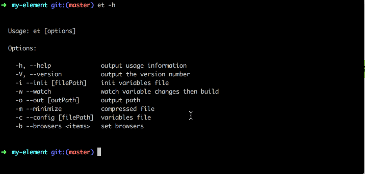

# element-theme
[](https://travis-ci.org/ElementUI/element-theme)
[](https://www.npmjs.com/package/element-theme)

> Theme generator cli tool for Element.



## Installation
install local or global
```shell
npm i element-theme -D
```

install `theme-default`
```shell
npm i element-theme-default -D
# or from github
npm i https://github.com/ElementUI/theme-default -D
```

## CLI
```shell
# init variables file
et --init [file path]

# watch then build
et --watch [--config variable file path] [--out theme path]

# build
et [--config variable file path] [--out theme path] [--minimize]
```

## Node API
```javascript
var et = require('element-theme')

// watch mode
et.watch({
  config: 'variables/path',
  out: 'output/path'
})

// build
et.run({
  config: 'variables/path',
  out: 'output/path',
  minimize: true
})
```

## Options
### config
Variable file path, default `./element-variables.css`.

### out
Theme output path, default `./theme`.

### minimize
Compressed file.

### browsers
set browsers, default `['ie > 9', 'last 2 versions']`.

### watch
watch variable file changes then build.

## Config
You can configure some options in `element-theme` by putting it in package.json:
```json
{
  "element-theme": {
    "browsers": ["ie > 9", "last 2 versions"],
    "out": "./theme",
    "config": "./element-variables.css",
    "minimize": false
  }
}
```

## License
MIT
